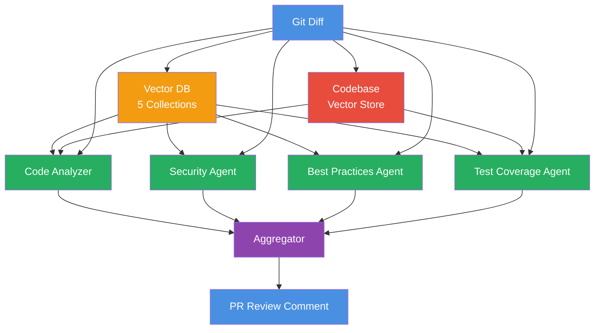

# Multi-Agent Code Review System

An AI-powered code review system using specialized agents with RAG to analyze code changes.

## Architecture



### Flow

1. **Input**: Code diff enters the system and codebase is indexed into vector store
2. **RAG Enhancement**: Vector search retrieves relevant patterns from 5 knowledge bases
3. **Codebase Context**: Code Analyzer and Test Coverage agents use FileSearchTool to search the codebase
4. **Parallel Analysis**: 4 specialized agents analyze the diff with RAG context and codebase context
5. **Aggregation**: Findings are deduplicated and merged by file/line
6. **Output**: Consolidated markdown report with severity-ranked issues

### Core Components

**Multi-Agent System**
- Code Analyzer: Detects bugs, logic errors, and antipatterns (with codebase context)
- Security Agent: Identifies security vulnerabilities
- Best Practices Agent: Checks code quality and maintainability
- Test Coverage Agent: Identifies missing test scenarios (with codebase context)
- Aggregator: Deduplicates and merges findings

**Codebase Context (FileSearchTool)**
- Fresh-per-PR vector store created from entire codebase
- Code Analyzer uses it to check cross-file dependencies
- Test Coverage Agent uses it to find existing tests
- Auto-expires after 1 day (zero idle costs)

**RAG Knowledge Base**
- 5 vector collections with 82 patterns
- Security (43): OWASP Top 10 2021 with CWE mappings
- Best practices (20): PEP 8, PEP 257 guidelines
- Python gotchas (9): Common pitfalls
- Code review (8): Google Engineering Practices
- Refactoring (7): Cross-file patterns

**Evaluation Framework**
- Hybrid evaluation: location metrics + LLM semantic relevance
- Metrics: file recall, line precision/recall, LLM relevance, composite score
- Benchmarks: BugsInPy (502 bugs), CVE (17 vulnerabilities), synthetic (5 test cases)

## Setup

```bash
# Install dependencies
uv sync

# Build knowledge bases
uv run -m code_review.rag.build_security_kb
uv run -m code_review.rag.build_best_practices_kb
uv run -m code_review.rag.build_python_gotchas_kb
uv run -m code_review.rag.build_code_review_kb
uv run -m code_review.rag.build_refactoring_patterns_kb
```

## Usage

```bash
# Run on sample diff
uv run run_review.py

# Run on custom diff file
uv run run_review.py path/to/diff.diff

# Run benchmarks
uv run -m code_review.benchmarks.synthetic
uv run -m code_review.benchmarks.bugsinpy
uv run -m code_review.benchmarks.cve
```

## Performance

**BugsInPy:** 100% pass rate (18/18 bugs)

**CVE:** 94% pass rate (16/17 vulnerabilities), 94% security detection

**Synthetic:** 5 hand-crafted test cases covering SQL injection, logic bugs, code quality, multi-file security

## Project Structure

```
code_review/
├── __init__.py
├── schemas.py              # Pydantic models
├── agents.py               # 4 review agents + aggregator
├── pipeline.py             # Main orchestration
├── vector_store.py         # Codebase vector store utilities
├── rag/
│   ├── retrieval.py        # Vector search functions
│   └── build_*.py          # Knowledge base builders (5)
└── benchmarks/
    ├── utils.py            # Evaluation utilities
    ├── synthetic.py        # Synthetic test cases
    ├── bugsinpy.py         # BugsInPy benchmark
    └── cve.py              # CVE benchmark

.github/
├── workflows/
│   └── code-review.yml     # GitHub Action workflow
└── actions/
    └── review-pr/          # Reusable action
```

## GitHub Action Integration

**To use this in your repositories:**

1. Add API keys as secrets in your repository (Settings → Secrets and variables → Actions):
   - `OPENAI_API_KEY`
   - `OPENROUTER_API_KEY`

2. Create `.github/workflows/code-review.yml`:
```yaml
name: AI Code Review

on:
  pull_request:
    types: [opened, synchronize, reopened]

jobs:
  review:
    runs-on: ubuntu-latest
    permissions:
      contents: read
      pull-requests: write

    steps:
      - name: Checkout code
        uses: actions/checkout@v4

      - name: Run AI Code Review
        uses: balazsthomay/code-review@main
        with:
          openai_api_key: ${{ secrets.OPENAI_API_KEY }}
          openrouter_api_key: ${{ secrets.OPENROUTER_API_KEY }}
          min_severity: 5
```

Every PR is automatically reviewed. Action passes if clean, fails and blocks merge if issues found. Includes codebase context via FileSearchTool (~30-60s indexing, ~$0.005 per PR).
